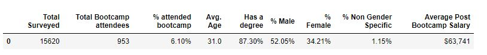
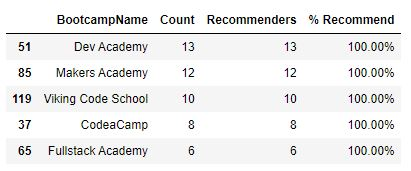

# Bootcamp Survey Analysis
Pandas project for Monash Data Analytics Boot Camp

The purpose of this project was to clean and analyse the bootcamp survey responses.

# Data

There is one key source of data used:

* [2016-FCC-New-Coders-Survey-Data.csv](Resources/2016-FCC-New-Coders-Survey-Data.csv) - .csv dataset composed of 113 columns

# Analysis

## Project part one

* Create a new table using the following columns: `[0, 1, 2, 3, 4, 7, 8, 9, 10, 11, 29, 30, 32, 36, 37, 45, 48, 56, 110, 111]`

* Replace all instances of "0.0" with No, and all instances of "1.0" with "Yes"

* Calculate the total number of respondents in the subtable

* Create a table out of the rows corresponding only to people who _did_ attend a bootcamp

* Calculate the number of people who attended a bootcamp

* Calculate the average age of bootcamp attendees

* Calculate the number of bootcamp attendees who self-identify as male; female; or neither

* Calculate the number of bootcamp attendees who hold college degrees

* Calculate the percentage of respondents who attended a bootcamp

* Calculate the percentage of people who attended a bootcamp and hold a college degree

* Calculate the average post-bootcamp salary

* Create a new, two-row table collecting the above data

* Use the `format` method to prettify your table

* Export the final table into an Excel file

## Project part two

* Create a new table using the following columns: `[0, 1, 2, 3, 4, 6, 7, 8, 9, 10, 11, 29, 30, 32, 36, 37, 45, 48, 56, 110, 111]`

* Replace all instances of "0.0" with No, and all instances of "1.0" with "Yes"

* Extract rows corresponding only to respondents who attended a bootcamp

* Create a DataFrame with two columns: One with the bootcamp name, and one with the number of respondents who went to each bootcamp

* Create another DataFrame with two columns: One for the bootcamp name, and one for the number of respondents who recommend it

* Create a new DataFrame by merging the previous two DataFrames on the appropriate column

* Create a new column containing the percentage of respondents for each bootcamp who would recommend that bootcamp

* Sort the new DataFrame in descending order of the percentage of recommenders you just calculated

* Use `map` and `format` to make the `"% Recommended"` column look more presentable

* Export the DataFrame to an Excel file

# Demo

To run the example locally run `project_part_one.ipynb` and `project_part_two.ipynb` files in Jupyter Notebook.

# Used Tools
 * Jupyter Notebook 
 * Pandas
